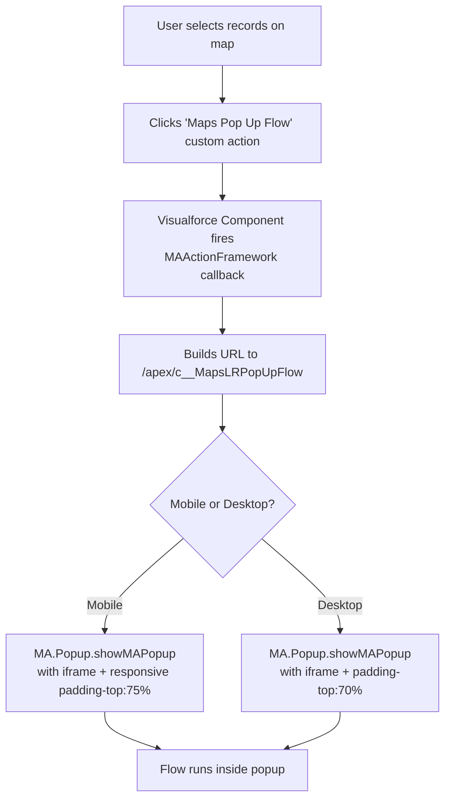
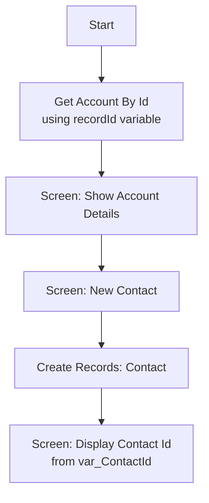

# sf-maps-custom-actions Skill

This skill covers building custom buttons and actions in Salesforce Maps: Map It buttons that open a record or layer on the map, Popup Flows that launch a Visualforce-hosted Flow from a map marker, and Multi-Record buttons that mass-update records directly from the map.

## When to Use This Skill

Trigger when the user is:
- Building a "Map It" button on a record page to open that record in Salesforce Maps
- Constructing a `URLFOR("/apex/maps__maps", ...)` formula for a Salesforce button
- Creating a Custom Action in Salesforce Maps that opens a Visualforce page or runs a flow
- Building a multi-record Custom Action that updates selected records from the map
- Setting up `Account_Map_It_Button_Settings__c` Custom Settings for dynamic Map It configuration

Do NOT trigger for:
- Legacy MapAnything-branded patterns (see `docs/sf-maps-legacy-patterns.md`)
- Generic Apex/Flow work without a Salesforce Maps context
- Territory shape association patterns (see `sf-maps-territory`)

---

## Hard-Stop Rules

If any of the following would be violated, stop and explain before proceeding:

| Constraint | Rationale |
|---|---|
| Never use `MAActionFramework.on('ready', ...)` as the custom action wrapper | This pattern throws a naming-validation error since late 2024 (KB 000394544); use `window.addEventListener('load', ...)` instead |
| Do not hardcode `baseObjectId` values in formulas without documenting the source org | `baseObjectId` values are org-specific record IDs — hardcoded values break in sandboxes and after refreshes |
| Always set Custom Action Text area to `[Custom]` when using JavaScript-based actions | Without `[Custom]`, the Maps UI attempts to evaluate the text area as a URL and the action fails |
| Do not rely on `forcetk.js` from a CDN rawgit URL in production | The rawgit CDN is decommissioned; host `forcetk.js` as a static resource in your org |

---

## Map It Button

A Map It button is a Salesforce Detail Page Button with **Content Source: URL** and **Behavior: Display in New Window**. The formula uses `URLFOR()` to generate a link to the Salesforce Maps Visualforce page (`/apex/maps__maps`).

### URL Parameters

| Parameter | Description |
|---|---|
| `layerid` | ID of a saved Maps layer to open |
| `layerids` | Comma-separated list of layer IDs |
| `recordId` | Salesforce record ID to plot on the map |
| `recordids` | Comma-separated list of record IDs |
| `baseObjectId` | ID of the Data Layer config object for the record type |
| `tooltipField` – `tooltipField8` | API names of fields to show in the map pin tooltip (up to 8) |
| `zoom` | Integer zoom level (e.g., `"8"`, `"16"`) |
| `color` | Hex color for the marker pin — must be URL-encoded (e.g., `URLENCODE("#66FF00")`) |

Append `?isdtp=vw` to the Visualforce path to open Maps in full-screen mode.

### Simple Map It Button

**Static single layer** (opens a saved layer by ID):
```
{! URLFOR("/apex/maps__maps", null, [layerId="a0O410000026nIE"]) }
```

**Dynamic single record** (plots the current Account on the map):
```
{!
URLFOR( "/apex/maps__maps",
      null,
      [recordId=Account.Id,
       baseObjectId="a2m0V000001GSPJQA4",
       tooltipField="Name",
       tooltipField2="OwnerId",
       tooltipField3="Type",
       tooltipField4="Ratings__c",
       zoom="16",
       color=URLENCODE("#66FF00")]
      )
}
```

### Intermediate Map It Button — Conditional by Account Type

Opens different layers and tooltip fields depending on whether the Account is a Customer:

```
{!
IF( TEXT(Account.Type) = "Customer",
    URLFOR( "/apex/maps__maps",
           null,
           [baseObjectId="a034100000JEBY7AAP",
            recordId=Account.Id,
            tooltipField="Name",
            tooltipField2="OwnerId",
            tooltipField3="Cloudbilt_CSM__c",
            tooltipField4="Customer_Segmentation__c",
            tooltipField5="CSM_Tier__c",
            tooltipField6="Owner.ManagerId",
            tooltipField7="Map_Territory__c",
            tooltipField8="Description",
            zoom="4",
            color=URLENCODE("#66FF00")]
          ),
    URLFOR( "/apex/maps__maps",
           null,
           [baseObjectId="a034100000JEBY7AAP",
            recordId=Account.Id,
            tooltipField="Name",
            tooltipField2="OwnerId",
            tooltipField3="Employee_Band_LinkedIn__c",
            tooltipField4="LinkedIn_Company_Search__c",
            tooltipField5="Website",
            tooltipField6="Linkedin__c",
            tooltipField7="Description",
            zoom="4",
            color=URLENCODE("#66FF00")]
          )
   )
}
```

### Advanced Map It Button — Custom Settings–Driven

Use a **Hierarchy Custom Setting** to manage defaults org-wide without touching button formulas.

**Custom Setting: `Account_Map_It_Button_Settings__c`** (Hierarchy type)

| Field Label | API Name | Type | Example Value |
|---|---|---|---|
| Base Object Id | `Base_ObjectId__c` | Text(15) | `a034100000JEBY7AAP` |
| Marker Color | `Color__c` | Text(10) | `#66FF00` |
| Full Screen | `Full_Screen__c` | Checkbox | `true` |
| Layer Id | `LayerId__c` | Text(255) | — |
| Zoom Level | `Zoom__c` | Number(2, 0) | `4` |

**Advanced button formula** (reads from Custom Setting; supports full-screen toggle):

```
{!
IF( TEXT(Account.Type) = "Customer",
    URLFOR( IF( $Setup.Account_Map_It_Button_Settings__c.Full_Screen__c,
                "/apex/maps__maps?isdtp=vw",
                "/apex/maps__maps"),
            null,
            [baseObjectId=$Setup.Account_Map_It_Button_Settings__c.Base_ObjectId__c,
             recordId=Account.Id,
             tooltipField="Name",
             tooltipField2="OwnerId",
             tooltipField3="Cloudbilt_CSM__c",
             tooltipField4="Customer_Segmentation__c",
             tooltipField5="CSM_Tier__c",
             tooltipField6="Owner.ManagerId",
             tooltipField7="Description",
             zoom=$Setup.Account_Map_It_Button_Settings__c.Zoom__c,
             color=URLENCODE($Setup.Account_Map_It_Button_Settings__c.Color__c)]
          ),
    URLFOR( IF( $Setup.Account_Map_It_Button_Settings__c.Full_Screen__c,
                "/apex/maps__maps?isdtp=vw",
                "/apex/maps__maps"),
            null,
            [baseObjectId=$Setup.Account_Map_It_Button_Settings__c.Base_ObjectId__c,
             recordId=Account.Id,
             tooltipField="Name",
             tooltipField2="OwnerId",
             tooltipField3="Employee_Band_LinkedIn__c",
             tooltipField4="LinkedIn_Company_Search__c",
             tooltipField5="Website",
             tooltipField6="Linkedin__c",
             tooltipField7="Description",
             zoom=$Setup.Account_Map_It_Button_Settings__c.Zoom__c,
             color=URLENCODE($Setup.Account_Map_It_Button_Settings__c.Color__c)]
          )
   )
}
```

**Full-screen only** (single record, no conditional logic):

```
{!
URLFOR( IF( $Setup.Account_Map_It_Button_Settings__c.Full_Screen__c,
               "/apex/maps__maps?isdtp=vw",
               "/apex/maps__maps"),
           null,
           [baseObjectId=$Setup.Account_Map_It_Button_Settings__c.Base_ObjectId__c,
            recordId=Account.Id,
            tooltipField="Name",
            tooltipField2="OwnerId",
            zoom=$Setup.Account_Map_It_Button_Settings__c.Zoom__c,
            color=URLENCODE($Setup.Account_Map_It_Button_Settings__c.Color__c)]
         )
}
```

### Relative URL Equivalents

For hard-coded use in Lightning components or Apex:

```
/apex/maps__Maps?layerid=a0O410000026nIE

/apex/maps__Maps?recordId=0014100000gXMTb&baseObjectId=a034100000JEBY7AAP&tooltipField=Name&tooltipField2=OwnerId&zoom=16&color=%2366FF00
```

---

## Popup Flow (Custom Action)

A Popup Flow launches a Salesforce Flow from within a Salesforce Maps Custom Action. The flow runs inside a Visualforce iframe rendered in a Maps popup overlay.

**Custom Action config in Maps:**
- Name: `Maps Pop Up Flow`
- Modes: Desktop + Mobile
- Action: `Load page in new window`
- Request Type: GET
- Text area: `[Custom]` (see Known Issues below)

**Architecture:**



**Flow example** (referenced as `Maps_Pop_up_Flow_v1`):



**Flow resources:**
- `recordId` — input String variable (receives the selected record's Id)
- `var_ContactId` — String variable (output from Create Records element)
- `Account from get_Account_By_Id` — record variable used in screen elements

**Visualforce page** (hosts the Lightning flow via `lightning:flow`):

```xml
<apex:page standardController="Account">
   <html>
      <head>
         <apex:includeLightning />
      </head>
      <body class="slds-scope">
         <div style="position: absolute; top: 0; left: 0; width: 100%; height: 100%; border: 0;" id="flowContainer" />
         <script>
            var statusChange = function (event) {
               if(event.getParam("status") === "FINISHED") {
                  // Handle flow completion — access outputVariables here if needed
               }
            };
            $Lightning.use("c:LightningRunTimeFlow", function() {
               $Lightning.createComponent("lightning:flow", {"onstatuschange":statusChange},
                  "flowContainer",
                  function (component) {
                     var inputVariables = [
                        {
                           name : 'recordId',
                           type : 'String',
                           value : "{!Account.Id}"
                        }
                     ];
                     component.startFlow("Maps_Pop_up_Flow_v1", inputVariables);
                  }
               );
            });
         </script>
      </body>
   </html>
</apex:page>
```

**Lightning App** (required to use `ltng:outApp` for `$Lightning.use`):

```xml
<aura:application access="global" extends="ltng:outApp" >
    <aura:dependency resource="lightning:flow"/>
</aura:application>
```

**Visualforce component** (registers the custom action handler):

```xml
<apex:component >
    <apex:slds></apex:slds>
    <script type='text/javascript'
            src='https://cdn.rawgit.com/developerforce/Force.com-JavaScript-REST-Toolkit/4ab6f9c6f4e83f6f8db07fc545a5c01cbff8e50a/forcetk.js'>
    </script>

    <script type='text/javascript'>
        // See Known Issues — replace MAActionFramework.on('ready', ...) with window.addEventListener('load', ...)
        window.addEventListener('load', function () {

            MAActionFramework.customActions['Maps Pop Up Flow'].Action = "Javascript";
            MAActionFramework.customActions['Maps Pop Up Flow'].events = {};
            MAActionFramework.customActions['Maps Pop Up Flow'].ActionValue = function (options) {
                var recordIdArray = [];
                for (var i = 0; i < options.records.length; i++) {
                    recordIdArray.push(options.records[i].Id);
                }
                var recordIdString = recordIdArray.join(',');

                var baseUrl = '/apex/c__MapsLRPopUpFlow?&id=';
                var fullUrl = baseUrl + recordIdString;

                if(MA.isMobile) {
                    var popupHTML =
                        '<div style="position: relative; overflow: hidden; padding-top: 75.00%;">' +
                           '<iframe style="position: absolute; top: 0; left: 0; width: 100%; height: 100%; border: 0;" src="' + fullUrl + '&isdtp=vw" />' +
                        '</div>';
                    MA.Popup.showMAPopup({
                        template: popupHTML,
                        popupId: 'customMobilePopUpId',
                        title: 'Maps Pop Up Flow',
                        subTitle: '',
                        buttons: [{ text: 'Close', type: 'slds-button_destructive', keepOpen: false }]
                    });
                } else {
                    var popupHTML =
                        '<div style="position: relative; overflow: hidden; padding-top: 70.00%;">' +
                           '<iframe style="position: absolute; top: 0; left: 0; width: 100%; height: 100%; border: 0;" src="' + fullUrl + '&isdtp=vw" />' +
                        '</div>';
                    MA.Popup.showMAPopup({
                        template: popupHTML,
                        popupId: 'customDesktopPopUpId',
                        title: 'Maps Pop Up Flow',
                        subTitle: '',
                        buttons: [{ text: 'Close', type: 'slds-button_destructive', keepOpen: false }]
                    });
                }
            };

        }); // End window load handler
    </script>
</apex:component>
```

---

## Multi-Record Custom Action

A Multi-Record button selects multiple records on the map and performs a bulk REST update against each one using ForceTK.js.

**Custom Action config in Maps:**
- Name: `Create Trailmix`
- Modes: Desktop + Mobile
- Action: `Load page in new window`
- Request Type: GET
- Text area: `[Custom]` (see Known Issues below)

**Visualforce component:**

```xml
<apex:component >
    <script type='text/javascript'
            src='https://cdn.rawgit.com/developerforce/Force.com-JavaScript-REST-Toolkit/4ab6f9c6f4e83f6f8db07fc545a5c01cbff8e50a/forcetk.js'>
    </script>
    <script type='text/javascript'>
        var $createContactStatus;

        // See Known Issues — replace MAActionFramework.on('ready', ...) with window.addEventListener('load', ...)
        window.addEventListener('load', function () {

            MAActionFramework.customActions['Create Trailmix'].Action = "Javascript";
            MAActionFramework.customActions['Create Trailmix'].events = {};
            MAActionFramework.customActions['Create Trailmix'].ActionValue = function (options) {
                $createContactStatus = MAToastMessages.showLoading({
                    message: MASystem.Labels.MA_Loading + '...',
                    timeOut: 0,
                    extendedTimeOut: 0
                });

                for (var i = 0; i < options.records.length; i++) {
                    standardRecordUpdate(options.records[i]);
                }
            };

            function standardRecordUpdate(record) {
                var client = new forcetk.Client();
                client.setSessionToken(MA.SessionId);
                client.update(
                    'Lead',
                    record.Id,
                    { Trailhead_Status__c: 'Available' },
                    function (response) {
                        MAToastMessages.hideMessage($createContactStatus);
                        MAToastMessages.showSuccess({ message: 'Successfully Created Trailmix.' });
                    },
                    function (err) {
                        MAToastMessages.hideMessage($createContactStatus);
                        MAToastMessages.showError({
                            message: 'Saving Error',
                            subMessage: err,
                            timeOut: 0,
                            extendedTimeOut: 0,
                            closeButton: true
                        });
                    }
                );
            }

        }); // End window load handler
    </script>
</apex:component>
```

**Adapt for other objects:** change `'Lead'` to the target SObject API name and replace `{ Trailhead_Status__c: 'Available' }` with the fields and values to update.

**Custom Components page** — deploy Visualforce components to your org's Custom Components page:
`https://{MY_DOMAIN}--maps.visualforce.com/apex/CustomComponents`

---

## Known Issues & Migration

**KB 000394544** — *Previously working custom action now triggers error message in Salesforce Maps* (Nov 15, 2024)

Custom actions that use the legacy `MAActionFramework.on('ready', function () {` pattern now throw:

> `"The name can only contain underscores and alphanumeric characters"`

**Fix:** Replace `MAActionFramework.on('ready', ...)` with `window.addEventListener('load', ...)`:

```javascript
// BEFORE (broken)
MAActionFramework.on('ready', function () {
    MAActionFramework.customActions['My Action'].Action = "Javascript";
    // ...
});

// AFTER (correct)
window.addEventListener('load', function () {
    MAActionFramework.customActions['My Action'].Action = "Javascript";
    // ...
});
```

The `MAActionFramework` object and other `MA.*` globals are still available inside the load handler — only the `on('ready', ...)` wrapper needs to change.

Salesforce also notes that using `[Custom]` in the Custom Action text area setting is unsupported. For new custom actions, prefer **Lightning Web Components** or **Visual Flow** actions over the Visualforce/JavaScript pattern.

---

## Delegate To

| Need | Skill |
|---|---|
| Maps installation, permission sets, Button Sets, or permission group setup | `sf-maps-setup` |
| Field rep routing, check-ins, or data layer configuration | `sf-maps-field` |
| Territory design or ATM assignment rules | `sf-maps-territory` |
| Apex class or trigger behind a custom action | `generating-apex` (afv-library) |
| Flow invoked by a Maps custom action | `generating-flow` (afv-library) |
| LWC-based custom action component | `generating-lwc` (afv-library) |
| Deploying Visualforce pages or custom action config | `deploying-metadata` (afv-library) |
