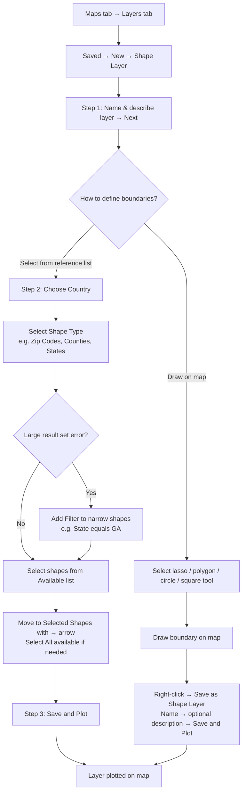

# sf-maps-field Skill

This skill guides **Salesforce Maps field sales workflows**: route optimization, markers, data layers, visit planning, check-ins, and mobile usage for field reps and their managers.

## When to Use This Skill

Trigger when the user is:
- Building or optimizing routes for field reps
- Configuring data layers (which Salesforce records appear on the map)
- Setting up visit scheduling, check-ins, or activity logging from Maps
- Asking about Salesforce Maps mobile app capabilities
- Designing a field sales workflow that involves the map view
- Configuring markers, custom marker icons, heat maps, proximity circles, or color rules for map records
- Creating or filtering shape layers (geographic boundary overlays)
- Building Map It buttons, popup flow actions, or multi-record custom actions
- Creating shareable links to Salesforce Maps layers
- Working with third-party data layers (business data, property data, NAICS/SIC filters)
- Configuring polyline layers

Do NOT trigger for:
- Initial Maps installation or permission setup (use `sf-maps-setup`)
- Territory design or ATM assignment rules (use `sf-maps-territory`)
- Generic Apex or Flow work unrelated to Maps field workflows (use upstream `sf-*` skills)

---

## Hard-Stop Rules

If any of the following would be violated, stop and explain before proceeding:

| Constraint | Rationale |
|---|---|
| Never design routes with more than ~25 stops | Maps routing is daily field planning, not fleet logistics — beyond ~25 stops, optimization quality degrades significantly |
| Never diagnose "record not on map" without checking `SFMaps__GeocodingStatus__c` first | Address fields may be populated while geocoding has failed; the status field is authoritative |
| Do not configure Check-In without creating the required custom activity fields first | Check-In silently drops location data if the Number/Checkbox fields are absent from the Activity object |
| Always verify the `SF Maps` permission set is assigned before troubleshooting layer visibility | A user without the permission set cannot see any Maps content regardless of layer configuration |
| Do not use Maps Advanced routing features without confirming the Maps Advanced license and OAuth user are configured | Routes will fail at optimization time without a valid OAuth user; confirm before building visit plans |

---

## Core Field Sales Objects

| Object | API Name | Purpose |
|---|---|---|
| Route | `SFMaps__Route__c` | A saved route for a rep on a given day |
| Route Stop | `SFMaps__RouteStop__c` | An individual stop on a route (linked to a Salesforce record) |
| Waypoint | `SFMaps__Waypoint__c` | A pass-through location on a route (no check-in; used for driving directions only) |
| Check-In | `SFMaps__CheckIn__c` | GPS-verified visit log when rep arrives at a stop |
| Marker | `SFMaps__Marker__c` | A custom point-of-interest pinned on the map (not tied to a Salesforce record) |
| Data Layer | `SFMaps__DataLayer__c` | Configuration for which object/record type appears as a map layer |
| Layer Filter | `SFMaps__LayerFilter__c` | Filter criteria applied to a Data Layer |

> **Namespace note:** `SFMaps__` objects (routing, check-ins, data layers) are part of the routing module and may not be installed in all orgs. The layer and geocoding objects — `maps__MarkerLayer__c`, `maps__BaseObject__c`, `maps__ShapeLayer__c`, etc. — use the `maps__` prefix and are always present. For verified field-level schemas see `sf-maps-setup/references/sf-maps-objects-maps-namespace.md`.

### Route → Waypoint → Base Object relationship

A Route contains ordered Route Stops and Waypoints. Route Stops link to a Salesforce base object record (Account, Lead, etc.) via `SFMaps__Stop__c`. Waypoints are address-only intermediate points that influence the driving path but do not generate check-ins or activities.

```
SFMaps__Route__c
  └── SFMaps__RouteStop__c  (lookup: SFMaps__Stop__c → any geocoded SObject)
  └── SFMaps__Waypoint__c   (address fields only; no Salesforce record lookup)
```

---

## Route Optimization

Routes are optimized for **daily field visits**. Key constraints:

| Parameter | Limit |
|---|---|
| Stops per route | Up to 25 (practical limit for one-day optimization) |
| Optimization algorithm | Nearest neighbor with time window support |
| Start/End location | Configurable per rep (home, office, or custom address) |
| Traffic | Real-time traffic factored into ETA calculations |

### Route Stop Statuses

| Status | Meaning |
|---|---|
| `Planned` | On the route, not yet visited |
| `Completed` | Rep checked in or marked complete |
| `Skipped` | Rep bypassed this stop |
| `Cancelled` | Removed from route |

---

## Marker Layers

Marker layers display Salesforce object records as pins on the map. Each layer maps to one base object.

### Marker Style Options

| Option | What It Does |
|---|---|
| Uniform | All markers use the same color and shape |
| Varied Based On 1 Field | Color and shape determined by a single field value |
| Varied Based On 2 Fields | One field controls color, another controls shape |
| Labeled Pins | Marker shows a text label (from Title Field or any field) instead of a shape |
| Ordered by a Field | Markers display a numeric order based on field value |

### Marker Layer Filters

Three filter types can narrow which records appear:

| Filter Type | Behavior |
|---|---|
| Field Filters | Filter by field values on the record or parent objects (not available for long text fields) |
| Activity Filters | Show objects with or without tasks/events in a specific time period |
| Cross Filters Set | Include/exclude records from related objects; up to 2 cross-object filters with subfilters |

### Heat Map

Toggle heat map mode on a marker layer to show data intensity by geographic concentration:

| Setting | Notes |
|---|---|
| Unit Radius in Pixels | Radius of influence per data point (recommended: 15) |
| Opacity | 0–100%; recommended 80% |
| Maximum Intensity | Fixed max to prevent outliers skewing the color scale (recommended: 5; for weighted fields, use 90% of max value) |
| Fade heat map with zoom | When off, radius increases with zoom to preserve visual intensity |
| Weighted Value | Field to weight heat map intensity (default: count of records) |
| Color Gradient | CSS3 color array (RGBA supported; HSL not supported) |

### Proximity Circles

Display proximity radius circles around markers in a layer:

| Setting | Notes |
|---|---|
| Show proximity around markers | Draws a circle around each marker |
| Hide proximity center markers | Hides the markers themselves, shows only circles |
| Hide markers outside of proximity | Shows only markers that fall within the proximity zone |
| Radius Distance + Distance Units | Sets the default radius and unit (miles or km) |

### Marker Popups

Configure what fields appear in the popup when a rep clicks a marker:
- **Details tab** — choose fields from the base object to display
- **Related tab** — add related objects and fields; shows up to 10 related records per marker
- Enable **In-Line editing** (via permission setting) to let reps update field values directly from the map popup

### Advanced Layer Options

| Option | Notes |
|---|---|
| Map Updates | Automatic refresh interval if dataset updates frequently |
| Tool Tip Default Tab | Set which tab (Details/Related) opens by default |
| Marker Limits | Cap the number of markers by count or proximity boundary |

---

## Data Layers

Data Layers control what records appear on the map and how they're styled. Each layer maps to one Salesforce object.

### Layer Configuration

| Setting | Notes |
|---|---|
| Object | Which SObject to display (Account, Lead, Opportunity, etc.) |
| Label Field | What text appears in the map pin tooltip |
| Lat/Lng Source | Must be a geocoded object (via Maps geocoding) |
| Filter | SOQL WHERE conditions to limit which records display |
| Color Rule | Field-based color coding (e.g., color accounts by `Industry` or `AnnualRevenue` range) |
| Distribution Method | How color ranges are bucketed: Automatic, Even Quantiles, Even Distribution, or Manual |
| Icon | Custom icon per record type or value |
| Max Records | Default 5,000 records per layer (configurable in Base Objects settings) |

### Common Layer Setups

**Accounts by ownership:**
- Object: `Account`
- Color Rule: `OwnerId = CURRENT_USER` → green; else → grey
- Filter: `SFMaps__GeocodingStatus__c = 'Geocoded'`

**Open opportunities by stage:**
- Object: `Opportunity`
- Color Rule: `StageName` → each stage a different color
- Filter: `IsClosed = false AND SFMaps__GeocodingStatus__c = 'Geocoded'`

---

## Check-Ins

When a rep arrives at a route stop, Maps can log a check-in:

- Creates a `SFMaps__CheckIn__c` record with GPS coordinates and timestamp
- Optionally creates a Salesforce Activity (Task or Event) on the parent record
- Configurable radius for "arrival detection" (Verification Distance in Base Object settings)

**Check-in → Activity logging:** Configure in Base Objects → Edit → Check In Settings:

| Setting | Behavior |
|---|---|
| Post To | Create a Chatter post, a task, an event, or a combination |
| Verification Distance | Radius (feet) required around the record address before check-in is allowed |
| Chatter Body | Template for Chatter post content; supports macros referencing Activity Settings fields |

**Custom Activity fields for check-ins** (create on the Task/Activity object with exact specs):

| Field Label | Type | Length / Decimals |
|---|---|---|
| Created Latitude | Number | 3 / 15 |
| Created Longitude | Number | 3 / 15 |
| Distance From Record (mi) | Number | 14 / 4 |
| Created Location Accuracy (m) | Number | 14 / 4 |
| Created Location Verified | Checkbox | — |
| Check Out Latitude | Number | 3 / 15 |
| Check Out Longitude | Number | 3 / 15 |
| Check Out Date | Date/Time | — |
| Check Out Accuracy (m) | Number | 14 / 4 |
| Check Out Distance From Record (mi) | Number | 14 / 4 |

Map these custom fields in Base Objects → Edit → Activity Settings.

**Auto Check Out:** Enable in Permission Group settings. When a rep checks in, Maps logs the activity and immediately marks it complete — no manual check-out required.

---

## Visit Planning (Proximity Search)

Reps can use the **Nearby** panel to find records within a radius of their current location or a selected address:

- Searches geocoded records in any configured marker layer
- Results sorted by distance
- Can add results directly to a route

The **Default Proximity Radius Distance** and **Default Proximity Type** can be set per permission group, with an optional user override.

---

## Mobile App

The Salesforce Maps mobile app (iOS and Android) supports:

- Full route view and navigation (turn-by-turn via native map app)
- Check-in at stops
- Nearby search
- Offline mode: routes and stop data cached locally for areas with poor connectivity
- Re-optimization: reps can re-optimize remaining stops on the fly
- SAML SSO with Salesforce as the service provider

**Mobile requirements for Live Tracking:**
- iPhone 8+ (iOS 14.0+), Samsung Galaxy S9+ or Google Pixel 2+ (Android 8.0+)
- 4G LTE network at 12 Mbps or faster
- **Note:** Live Tracking in the mobile app is scheduled for retirement August 31, 2026

**Mobile configuration:** Installed Packages → Configure → Permission Groups → configure offline cache size, navigation app, check-in radius, and auto check-out.

**Mainland China restriction:** The Salesforce Maps mobile app is not available in Mainland China. Reps in China can access Maps via desktop only.

---

## SOQL Patterns

Find today's routes for a user:
```soql
SELECT Id, Name, SFMaps__Date__c, SFMaps__Status__c,
       (SELECT Id, SFMaps__Stop__c, SFMaps__Status__c FROM SFMaps__RouteStops__r ORDER BY SFMaps__StopOrder__c)
FROM SFMaps__Route__c
WHERE SFMaps__User__c = :userId
AND SFMaps__Date__c = TODAY
```

Find all check-ins this week:
```soql
SELECT Id, SFMaps__User__c, SFMaps__CheckInTime__c, SFMaps__Latitude__c, SFMaps__Longitude__c,
       SFMaps__Record__c
FROM SFMaps__CheckIn__c
WHERE SFMaps__CheckInTime__c = THIS_WEEK
ORDER BY SFMaps__CheckInTime__c DESC
```

Find skipped stops this month (rep performance):
```soql
SELECT SFMaps__Route__r.SFMaps__User__c, COUNT(Id) skipped
FROM SFMaps__RouteStop__c
WHERE SFMaps__Status__c = 'Skipped'
AND SFMaps__Route__r.SFMaps__Date__c = THIS_MONTH
GROUP BY SFMaps__Route__r.SFMaps__User__c
ORDER BY skipped DESC
```

---

## Third-Party Data Layers

Third-party data layers plot external data (business listings, property records, census data, etc.) as markers on the map for location analysis. Access via: **Maps tab → Layers tab → Saved → New → Data Layer**.

### Data Layer Editor — 5-Step Wizard

| Step | Panel | What to do |
|---|---|---|
| 1 | Name your layer | Enter a name; choose Personal (only you) or Cooperative (shared) folder |
| 2 | Choose data source | Select data source (e.g. Business Data (USA), Business Data (Canada), Property Data) and level of detail |
| 3 | Filter your layer | Add one or more Topic/Operator/Value filters (optional) |
| 4 | Add data to tooltip | Select Header and Detail fields shown when clicking a marker |
| 5 | Style your layer | Choose visual style (marker type/color) → Save and Plot |

### Filter Operators

| Operator | Use when |
|---|---|
| `equals` | Exact match; use multiple values in one field for OR logic (e.g. GA, NC in same box) |
| `not equal to` | Exclude records matching a specific value |
| `starts with` | Value begins with known text (e.g. "Auto" matches "Auto Service Center") |
| `contains` | Value includes text anywhere; broader than Starts With; not case-sensitive |
| `does not contain` | Exclude records where field includes text (e.g. exclude "PO Box" addresses) |
| `less than` | Numeric: strictly below value |
| `less or equal` | Numeric: at or below value |
| `greater or equal` | Numeric: at or above value |
| `range` | Numeric: ≥ minimum and < maximum |

**Value input types:** Depending on the selected Topic, the Value field is a picklist, true/false dropdown, or free text. Click into the Value field to see which type appears.

**OR vs AND logic:**
- To filter for records in state GA *or* NC: put both values in the *same* Value field (`GA, NC`)
- To filter for records in Atlanta *and* GA: use *two separate filter rows* (one per condition)

### Filtering by NAICS / SIC Code

NAICS (North American Industry Classification) and SIC (Standard Industrial Classification) codes identify businesses by economic activity. Salesforce Maps exposes both full codes and description fields at each level.

**NAICS levels:**

| Digits | Level | Example |
|---|---|---|
| 2 | Sector | 11 = Agriculture, Forestry, Fishing and Hunting |
| 3 | Sub-Sector | 111 = Crop Production |
| 4 | Industry Group | 1111 = Oilseed and Grain Farming |
| 5 | North American Industry | 11113 = Dry Pea and Bean Farming |
| 6 | US Industry | 111130 = Dry Pea and Bean Farming |

**SIC levels:**

| Digits | Level | Example |
|---|---|---|
| Letter | Division | A = Agriculture, Forestry & Fishing |
| 2 | Major Group | 01 = Agricultural Production - Crops |
| 3 | Industry Group | 011 = Cash Grains |
| 4 | Industry | 0111 = Wheat |
| 5–8 | Sub Industry | 011100 = Wheat |

Use the description fields (e.g. `NAICS02 Description equals Commercial and Institutional Building Construction`) rather than raw codes when filtering for readability.

### Tooltip Configuration

The tooltip is the popup shown when a user clicks a marker. Configure in the "Add data to tooltip" step:
- **Add a header** — prominent field(s) shown at the top
- **Add a detail** — supporting fields shown in the body (up to 5)

After saving, use **Options → Refresh** on the layer panel to reload markers when panning to a new map area.

### Click2Create

Click2Create lets reps create Salesforce records directly from third-party data layer markers. From a business data POI marker, reps can create an Account; from a property data marker, they can create a Lead.

Configure in **Installed Packages → Configure → Click2Create™**:
1. Select the data source (Business Data or Property Data)
2. Map source fields to Salesforce target fields
3. Create a field set on the target object to control which fields appear in the creation form
4. Assign the Click2Create button to a Button Set so it appears in the marker popup

### Troubleshooting

- **No results returned:** For text fields, try entering multiple variants (e.g. `93` and `1993` for year). For picklists, confirm you *selected* the value from the dropdown rather than typing it.
- **Results include wrong states:** Check OR vs AND logic above — multiple values in the same row means OR; separate rows means AND.
- **Markers plotted at center of screen:** The layer has no location filter and is plotting from the center of the bounding box outward. Add a geographic filter or pan and refresh.

---

## ArcGIS Layers

For ArcGIS Living Atlas layer consumption and ArcGIS Connectors (batch push of Salesforce records to ArcGIS Online/Enterprise), see `sf-maps-arcgis`.

---

## Polyline Layers

Polyline layers display line geometries (utility lines, roads, routes) on the map. Requires:

1. A custom object or base object with geolocation vertex fields (`maps__Latitude__c`, `maps__Longitude__c` or equivalent) describing each point on the line
2. Polyline Layers enabled in the Permission Group for users who need to see them
3. **Note:** Polyline layers are not supported in Enhanced User Experience mode

---

## Shape Layers

Shape layers overlay geographic boundaries (states, ZIP codes, counties, census tracts, etc.) on the map. Use them to visualize territories or proximity areas. See `references/sf-maps-shape-layer-countries.md` for the full list of supported countries and shape types.

### Shape Layer Builder — Wizard Flow



### Step-by-Step: Create from Reference List

1. On the Navigation Bar, select **Maps**
2. Select the **Layers** tab
3. Select **Saved** tab → desired folder → **New → Shape Layer**
4. Name your shape layer → add optional description → **Next**
5. Choose the **country**
6. Select **Shape type** (e.g. cities, ZIP codes, census tracts)
7. If you see the error "The shape type you want to see returns a large number of results. Please add a filter to narrow down the available shapes" — click **Add Filter** and filter by state or other criteria
8. Select shapes from the **Available Shapes** list, or click **Select All**
9. Press the **→ arrow** to move selected shapes to the **Selected Shapes** list
10. To remove a shape from Selected, highlight it and press the **← arrow**
11. Click **Done** on any filter
12. Review your Selected Shapes list
13. Click **Save and Plot**

### Lasso / Draw Tool (Manual Shape)

Use the lasso tool to draw a custom shape on the map instead of selecting from reference:

1. Open Shape Layer Builder → leave Shape Selection on **Draw on Map**
2. Select a draw tool: polygon, circle, or square
3. Draw your boundary on the map
4. Right-click → **Save as Shape Layer** → name → optional description → **Save and Plot**

### Managing an Existing Shape Layer

**Removing shapes:** Use the **Remove Shapes Drawing Tool** or the **Individual Shape Selector** to deselect shapes from a layer.

**Unmerging boundaries:** When first created, a shape layer may appear as a single merged area. To see individual boundaries:
- Hover over the layer name → eyeball icon (**Shape Display**) → uncheck **Merge Boundaries**

**Showing boundary labels:** Hover over the layer name → eyeball icon (**Shape Display**) → check **Show shape label(s)**

---

## Shareable Layer Link

A shareable link lets users navigate directly to a Salesforce Maps layer from a record page or any URL. It works with Marker Layers (`maps__MarkerLayer__c`), Data Layers (`maps__Layer__c`), Shape Layers (`maps__ShapeLayer__c`), and Locations (`maps__Location__c`).

### Setup Steps

1. **Create a custom tab** for the Maps object you want to share:
   - Setup → User Interface → Tabs → **New Custom Object Tab**
   - Select the object (e.g. `maps__MarkerLayer__c`)

2. **Create a Formula field** on the Maps object:
   - Setup → Object Manager → `{Maps Object}` → Fields & Relationships → **New**
   - Data Type: `Formula`
   - Field Label: `{Object Name} Shareable Link`  
   - API Name: `Maps_Marker_Layer_Shareable_Link__c`
   - Formula Return Type: `Text`
   - Formula:
     ```
     HYPERLINK(
       "/apex/maps__Maps?&layerid=" & Id,
       LEFT($Api.Partner_Server_URL_260, FIND('/services', $Api.Partner_Server_URL_260))
         & "apex/maps__Maps?&layerid=" & Id
     )
     ```
   - Help Text: `Right Click on the URL and Select Copy Link Address`

3. **Add the field to the page layout:**
   - Setup → Object Manager → `{Maps Object}` → Page Layouts → edit layout → add the formula field

4. **Navigate to the layer record** via the custom tab, then right-click the Shareable Link field value and copy the link address.

The generated URL format looks like:
```
https://ma.my.salesforce.com/apex/maps__Maps?&layerId=<record Id>
```

---

## Delegate To

| Need | Skill |
|---|---|
| Maps package installation, permission sets, or geocoding setup | `sf-maps-setup` |
| Territory design, ATM hierarchy, or assignment rules | `sf-maps-territory` |
| Map It buttons, Popup Flows, or multi-record custom actions | `sf-maps-custom-actions` |
| ArcGIS Living Atlas layers or ArcGIS Connectors batch push | `sf-maps-arcgis` |
| Apex trigger on `SFMaps__CheckIn__c`, `SFMaps__Route__c`, or other Maps objects | `generating-apex` (afv-library) |
| Flow triggered by route completion, check-in, or activity creation | `generating-flow` (afv-library) |
| LWC component that reads or writes Maps objects | `generating-lwc` (afv-library) |
| Deploying Maps field config to production | `deploying-metadata` (afv-library) |
